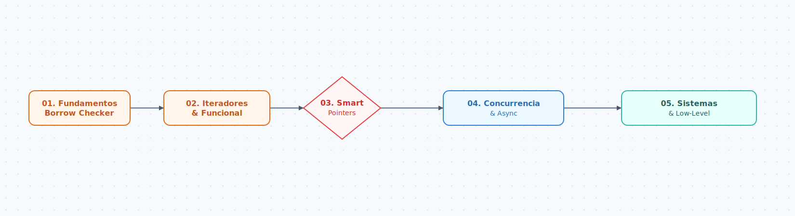

[](https://codespaces.new/)

## `< Tech Stack />`

[](https://www.rust-lang.org/)
[](https://doc.rust-lang.org/cargo/)

# Portafolio Rust

## `Ejecutar ejercicios en Codespaces (menu interactivo)`

En la terminal:

```sh
./menu.sh
```

Nota: `menu.sh` puede ejecutarse directamente en Codespaces; si por alguna razón no puede ejecutarlo, use `bash menu.sh`.

## `Propósito`

Portafolio Rust recopila ejercicios en Rust organizados por niveles de aprendizaje. El objetivo es mostrar implementaciones pedagógicas y autocontenidas mientras se avanza en temas clave: ownership, iteradores, smart pointers, concurrencia, async y aspectos de bajo nivel.

<p align="center">
	
</p>

## `Ejecutar un ejercicio (directo con Cargo)`

Los ejercicios están en `./examples`.

```sh
cargo run --example n1_01_enums_datos_enum
```

## `Estructura`

- `examples/` → ejercicios autocontenidos (1 archivo por ejercicio)
- `src/lib.rs` → utilidades compartidas opcionales (helpers)

## `Nota sobre crates externos`

Algunos ejercicios avanzados pueden requerir crates comunes (por ejemplo: `tokio`, `rayon`) o APIs específicas del sistema. En esos casos, el ejercicio se deja marcado como pendiente (◻) hasta agregar dependencias/configuración.

## `Ejercicios`

Leyenda


☑ Completado

◻ Pendiente

<details>
	<summary><h3><strong><code>01 :: Borrow Checker & Tipado</code></strong></h3></summary>

| Status | Exercise | Topic | Source | Run |
|---|---|---|---|---|
| ☑ | Enums con Datos  (V4/V6) | `enum` | [View Code](examples/nivel1/n1_01_enums_datos_enum.rs) | `cargo run --example n1_01_enums_datos_enum` |
| ☑ | Manejo de Errores (Result): división segura | `result` | [View Code](examples/nivel1/n1_02_manejo_errores.rs) | `cargo run --example n1_02_manejo_errores` |
| ☑ | Option Chaining: map + and_then | `option / match` | [View Code](examples/nivel1/n1_03_option_chaining.rs) | `cargo run --example n1_03_option_chaining` |
| ☑ | Ownership Move: consumir String y devolverlo | `ownership` | [View Code](examples/nivel1/n1_04_propiedad_mover.rs) | `cargo run --example n1_04_propiedad_mover` |
| ☑ | Borrowing: longitud sin tomar ownership | `ownership` | [View Code](examples/nivel1/n1_05_borrowing_longitud.rs) | `cargo run --example n1_05_borrowing_longitud` |
| ☑ | Slices de String: primera palabra | `slices` | [View Code](examples/nivel1/n1_06_slice_string.rs) | `cargo run --example n1_06_slice_string` |
| ☑ | Structs con Métodos: Rectangulo | `struct` | [View Code](examples/nivel1/n1_07_structs_m_todos.rs) | `cargo run --example n1_07_structs_m_todos` |
| ☑ | Pattern Matching Avanzado: match tupla | `match` | [View Code](examples/nivel1/n1_08_pattern_matching.rs) | `cargo run --example n1_08_pattern_matching` |
| ☑ | If Let: refactorizar match | `match / if let` | [View Code](examples/nivel1/n1_09_if_let_refactorizar.rs) | `cargo run --example n1_09_if_let_refactorizar` |
| ☑ | Vectores y Capacidad: with_capacity | `vectores` | [View Code](examples/nivel1/n1_10_vector_capacidad.rs) | `cargo run --example n1_10_vector_capacidad` |
| ☑ | HashMaps de Conteo: .entry().or_insert() | `hashmap` | [View Code](examples/nivel1/n1_11_hashmap_conteo.rs) | `cargo run --example n1_11_hashmap_conteo` |
| ☑ | Panic Controlado: estado inconsistente | `result / panic` | [View Code](examples/nivel1/n1_12_panic_controlado.rs) | `cargo run --example n1_12_panic_controlado` |
| ☑ | Shadowing: string | `shadowing` | [View Code](examples/nivel1/n1_13_shadowing_string.rs) | `cargo run --example n1_13_shadowing_string` |
| ☑ | Loops con Etiquetas: break outer/inner | `loops` | [View Code](examples/nivel1/n1_14_loops_etiquetas.rs) | `cargo run --example n1_14_loops_etiquetas` |
| ☑ | Traits Derivados: Debug/PartialEq/Clone | `struct / clone` | [View Code](examples/nivel1/n1_15_traits_derivados.rs) | `cargo run --example n1_15_traits_derivados` |
| ☑ | Copy vs Clone: int vs String | `copy / clone` | [View Code](examples/nivel1/n1_16_copy_vs_clone.rs) | `cargo run --example n1_16_copy_vs_clone` |
| ☑ | From/Into Traits: implementar From<&str> | `struct / from` | [View Code](examples/nivel1/n1_17_from_into_traits.rs) | `cargo run --example n1_17_from_into_traits` |
| ☑ | Custom Display: std::fmt::Display | `display` | [View Code](examples/nivel1/n1_18_custom_display.rs) | `cargo run --example n1_18_custom_display` |
| ☑ | Lifetimes Básicos: devolver &str más larga | `lifetime` | [View Code](examples/nivel1/n1_19_lifetimes_b_sicos.rs) | `cargo run --example n1_19_lifetimes_b_sicos` |
| ☑ | Unit Testing: #[cfg(test)] | `test` | [View Code](examples/nivel1/n1_20_unit_testing.rs) | `cargo run --example n1_20_unit_testing` |

</details>

<details>
	<summary><h3><strong><code>02 :: Iteradores & Funcional</code></strong></h3></summary>

| Status | Exercise | Topic | Source | Run |
|---|---|---|---|---|
| ☑ | Map y Filter: cuadrados de pares y sumar | `vec / map` | [View Code](examples/nivel2/n2_01_map_filter_cuadrados.rs) | `cargo run --example n2_01_map_filter_cuadrados` |
| ☑ | Fold: suma con fold | `fold` | [View Code](examples/nivel2/n2_02_fold_suma_fold.rs) | `cargo run --example n2_02_fold_suma_fold` |
| ☑ | Zip: dos vectores a HashMap | `hashmap / zip` | [View Code](examples/nivel2/n2_03_zip_dos_vectores.rs) | `cargo run --example n2_03_zip_dos_vectores` |
| ☑ | Iteradores infinitos: filtrar primos y take(5) | `iteradores` | [View Code](examples/nivel2/n2_04_iterador_infinitos.rs) | `cargo run --example n2_04_iterador_infinitos` |
| ☑ | FlatMap: aplanar Vec<Vec<i32>> | `vec / flatmap` | [View Code](examples/nivel2/n2_05_flatmap_aplanar.rs) | `cargo run --example n2_05_flatmap_aplanar` |
| ☑ | Collect: Vec/HashSet/LinkedList con turbofish | `vec / collect` | [View Code](examples/nivel2/n2_06_collect_vector.rs) | `cargo run --example n2_06_collect_vector` |
| ☑ | Closures: Fn/FnMut/FnOnce | `closure` | [View Code](examples/nivel2/n2_07_closures_fn_fnmut.rs) | `cargo run --example n2_07_closures_fn_fnmut` |
| ☑ | Captura de Entorno: closure mut | `closure` | [View Code](examples/nivel2/n2_08_captura_entorno.rs) | `cargo run --example n2_08_captura_entorno` |
| ☑ | Iteradores Personalizados: Iterator para Contador | `struct / iterator` | [View Code](examples/nivel2/n2_09_iterador_personalizados.rs) | `cargo run --example n2_09_iterador_personalizados` |
| ☑ | Peekable: mirar sin consumir | `peekable` | [View Code](examples/nivel2/n2_10_peekable_mirar.rs) | `cargo run --example n2_10_peekable_mirar` |
| ☑ | Chain: unir iteradores | `chain` | [View Code](examples/nivel2/n2_11_chain_unir_iteradores.rs) | `cargo run --example n2_11_chain_unir_iteradores` |
| ☑ | Cycle: patrón alterno | `cycle` | [View Code](examples/nivel2/n2_12_cycle_patr_n.rs) | `cargo run --example n2_12_cycle_patr_n` |
| ☑ | Partition: separar en dos listas | `partition` | [View Code](examples/nivel2/n2_13_partition_separar.rs) | `cargo run --example n2_13_partition_separar` |
| ☑ | Find vs Position | `find / position` | [View Code](examples/nivel2/n2_14_find_vs_position.rs) | `cargo run --example n2_14_find_vs_position` |
| ☑ | Lazy Evaluation: nada hasta consumir | `collect / lazy` | [View Code](examples/nivel2/n2_15_lazy_evaluation.rs) | `cargo run --example n2_15_lazy_evaluation` |
| ☑ | Any y All: cortocircuito | `any / all` | [View Code](examples/nivel2/n2_16_any_all_cortocircuito.rs) | `cargo run --example n2_16_any_all_cortocircuito` |
| ☑ | String parsing funcional: CSV | `string` | [View Code](examples/nivel2/n2_17_string_parsing.rs) | `cargo run --example n2_17_string_parsing` |
| ☑ | Option Iter: flatten | `option / vec` | [View Code](examples/nivel2/n2_18_option_iter_flatten.rs) | `cargo run --example n2_18_option_iter_flatten` |
| ☑ | Windows: ventana deslizante | `windows` | [View Code](examples/nivel2/n2_19_windows_ventana.rs) | `cargo run --example n2_19_windows_ventana` |
| ☑ | Cow: Clone on Write | `borrow / clone` | [View Code](examples/nivel2/n2_20_cow_clone_on.rs) | `cargo run --example n2_20_cow_clone_on` |

</details>

<details>
	<summary><h3><strong><code>03 :: Smart Pointers & Datos</code></strong></h3></summary>

| Status | Exercise | Topic | Source | Run |
|---|---|---|---|---|
| ☑ | Box: estructura recursiva | `box` | [View Code](examples/nivel3/n3_01_box_estructura.rs) | `cargo run --example n3_01_box_estructura` |
| ☑ | Deref Trait: smart pointer propio | `struct / trait` | [View Code](examples/nivel3/n3_02_deref_trait_smart.rs) | `cargo run --example n3_02_deref_trait_smart` |
| ☑ | Drop Trait: destructor personalizado | `trait / drop` | [View Code](examples/nivel3/n3_03_drop_trait_destructor.rs) | `cargo run --example n3_03_drop_trait_destructor` |
| ☑ | Rc: propiedad compartida | `thread` | [View Code](examples/nivel3/n3_04_rc_propiedad_compartida.rs) | `cargo run --example n3_04_rc_propiedad_compartida` |
| ☑ | RefCell: interior mutability | `refcell` | [View Code](examples/nivel3/n3_05_refcell_interior.rs) | `cargo run --example n3_05_refcell_interior` |
| ☑ | Weak: romper ciclos | `weak` | [View Code](examples/nivel3/n3_06_weak_romper_ciclos.rs) | `cargo run --example n3_06_weak_romper_ciclos` |
| ☑ | Arc: atomic reference counting | `arc / atomic` | [View Code](examples/nivel3/n3_07_arc_atomic_reference.rs) | `cargo run --example n3_07_arc_atomic_reference` |
| ☑ | Mutex: proteger dato compartido | `mutex` | [View Code](examples/nivel3/n3_08_mutex_proteger.rs) | `cargo run --example n3_08_mutex_proteger` |
| ☑ | RwLock: muchos lectores/un escritor | `mutex / rwlock` | [View Code](examples/nivel3/n3_09_rwlock_muchos.rs) | `cargo run --example n3_09_rwlock_muchos` |
| ☑ | Cell: mutación interior en Copy | `copy / refcell` | [View Code](examples/nivel3/n3_10_cell_mutaci_n.rs) | `cargo run --example n3_10_cell_mutaci_n` |
| ☑ | Árbol binario: Option<Box<Node>> | `option / box` | [View Code](examples/nivel3/n3_11_rbol_binario.rs) | `cargo run --example n3_11_rbol_binario` |
| ☑ | Double Linked List: boss final | `refcell / unsafe` | [View Code](examples/nivel3/n3_12_double_enlazada.rs) | `cargo run --example n3_12_double_enlazada` |
| ☑ | Graphs con indices: arena allocation | `vec` | [View Code](examples/nivel3/n3_13_graphs_indices.rs) | `cargo run --example n3_13_graphs_indices` |
| ☑ | Generics en Structs: Punto<T> | `struct` | [View Code](examples/nivel3/n3_14_generics_struct.rs) | `cargo run --example n3_14_generics_struct` |
| ☑ | Trait Bounds: Display + PartialOrd | `trait / display` | [View Code](examples/nivel3/n3_15_trait_bounds.rs) | `cargo run --example n3_15_trait_bounds` |
| ☑ | PhantomData: ownership fantasma | `ownership / phantomdata` | [View Code](examples/nivel3/n3_16_phantomdata_propiedad.rs) | `cargo run --example n3_16_phantomdata_propiedad` |
| ☑ | Builder Pattern | `builder` | [View Code](examples/nivel3/n3_17_builder_pattern_1_1.rs) | `cargo run --example n3_17_builder_pattern_1_1` |
| ☑ | Newtype Pattern: Metros(u32) | `newtype` | [View Code](examples/nivel3/n3_18_newtype_pattern.rs) | `cargo run --example n3_18_newtype_pattern` |
| ☑ | Sized vs ?Sized: trait objects | `trait / box` | [View Code](examples/nivel3/n3_19_sized_vs_sized.rs) | `cargo run --example n3_19_sized_vs_sized` |
| ☑ | Static lifetime: static vs const | `lifetime` | [View Code](examples/nivel3/n3_20_static_lifetime.rs) | `cargo run --example n3_20_static_lifetime` |

</details>

<details>
	<summary><h3><strong><code>04 :: Concurrencia & Async</code></strong></h3></summary>

| Status | Exercise | Topic | Source | Run |
|---|---|---|---|---|
| ☑ | Spawn threads: 10 hilos + join | `spawn` | [View Code](examples/nivel4/n4_01_spawn_threads_10.rs) | `cargo run --example n4_01_spawn_threads_10` |
| ☑ | Move closures en hilos | `move / closures` | [View Code](examples/nivel4/n4_02_mover_closure.rs) | `cargo run --example n4_02_mover_closure` |
| ☑ | Canales MPSC: productor-consumidor | `mpsc / canales` | [View Code](examples/nivel4/n4_03_canales_mpsc.rs) | `cargo run --example n4_03_canales_mpsc` |
| ☑ | Deadlock intencional | `mutex / deadlock` | [View Code](examples/nivel4/n4_04_deadlock_intencional.rs) | `cargo run --example n4_04_deadlock_intencional` |
| ☑ | Condvar: esperar señal | `condvar` | [View Code](examples/nivel4/n4_05_condvar_esperar.rs) | `cargo run --example n4_05_condvar_esperar` |
| ☑ | Barrier: sincronizar 5 hilos | `barrier` | [View Code](examples/nivel4/n4_06_barrier_sincronizar.rs) | `cargo run --example n4_06_barrier_sincronizar` |
| ☑ | Atomic types: contador global | `atomic / contador` | [View Code](examples/nivel4/n4_07_atomic_types.rs) | `cargo run --example n4_07_atomic_types` |
| ◻ | Rayon: paralelismo de datos | `rayon` | [View Code](examples/nivel4/n4_08_rayon_paralelismo.rs) | `cargo run --example n4_08_rayon_paralelismo` |
| ☑ | Send y Sync: tipo no-Send | `send / sync` | [View Code](examples/nivel4/n4_09_send_sync_tipo.rs) | `cargo run --example n4_09_send_sync_tipo` |
| ☑ | Scoped threads: thread::scope | `scoped / threads` | [View Code](examples/nivel4/n4_10_scoped_hilos.rs) | `cargo run --example n4_10_scoped_hilos` |
| ◻ | Async hello: función async + runtime | `async` | [View Code](examples/nivel4/n4_11_async_hello_funci.rs) | `cargo run --example n4_11_async_hello_funci` |
| ☑ | Await: dos llamadas async secuenciales | `await / async` | [View Code](examples/nivel4/n4_12_await_dos_llamadas.rs) | `cargo run --example n4_12_await_dos_llamadas` |
| ☑ | Select!: esperar primera promesa | `select / future` | [View Code](examples/nivel4/n4_13_select_esperar.rs) | `cargo run --example n4_13_select_esperar` |
| ☑ | Async streams: while let | `streams / async` | [View Code](examples/nivel4/n4_14_async_streams.rs) | `cargo run --example n4_14_async_streams` |
| ◻ | Tokio tasks: miles de tasks | `tokio` | [View Code](examples/nivel4/n4_15_tokio_tasks_miles.rs) | `cargo run --example n4_15_tokio_tasks_miles` |
| ☑ | Actor pattern: canales | `actor` | [View Code](examples/nivel4/n4_16_actor_pattern.rs) | `cargo run --example n4_16_actor_pattern` |
| ☑ | Shared state async: Arc<Mutex<HashMap>> | `shared / state` | [View Code](examples/nivel4/n4_17_shared_state.rs) | `cargo run --example n4_17_shared_state` |
| ☑ | Pinning: por qué se necesita Pin | `pin / future` | [View Code](examples/nivel4/n4_18_pinning_qu_necesita.rs) | `cargo run --example n4_18_pinning_qu_necesita` |
| ☑ | Futures manuales: implementar Future | `trait / future` | [View Code](examples/nivel4/n4_19_futures_manuales.rs) | `cargo run --example n4_19_futures_manuales` |
| ◻ | Graceful shutdown: Ctrl+C | `shutdown` | [View Code](examples/nivel4/n4_20_graceful_shutdown.rs) | `cargo run --example n4_20_graceful_shutdown` |

</details>

<details>
	<summary><h3><strong><code>05 :: Sistemas & Low-Level</code></strong></h3></summary>

| Status | Exercise | Topic | Source | Run |
|---|---|---|---|---|
| ☑ | FFI (C to Rust): extern "C" | `ffi` | [View Code](examples/nivel5/n5_01_ffi_c_to.rs) | `cargo run --example n5_01_ffi_c_to` |
| ◻ | FFI (Rust to C): llamar abs de C | `ffi` | [View Code](examples/nivel5/n5_02_ffi_rust_to.rs) | `cargo run --example n5_02_ffi_rust_to` |
| ☑ | Unsafe pointer dereference | `unsafe` | [View Code](examples/nivel5/n5_03_unsafe_pointer.rs) | `cargo run --example n5_03_unsafe_pointer` |
| ☑ | Union: interpretar bytes como f32/u32 | `union` | [View Code](examples/nivel5/n5_04_union_interpretar.rs) | `cargo run --example n5_04_union_interpretar` |
| ☑ | Macro declarativa: vec_strs! | `macro` | [View Code](examples/nivel5/n5_05_macro_declarativa.rs) | `cargo run --example n5_05_macro_declarativa` |
| ☑ | Macro procedural (derive) esqueleto | `macro` | [View Code](examples/nivel5/n5_06_macro_procedural.rs) | `cargo run --example n5_06_macro_procedural` |
| ◻ | Custom allocator: jemalloc | `allocator` | [View Code](examples/nivel5/n5_07_custom_allocator.rs) | `cargo run --example n5_07_custom_allocator` |
| ◻ | SIMD portable | `simd` | [View Code](examples/nivel5/n5_08_simd_portable_1_1.rs) | `cargo run --example n5_08_simd_portable_1_1` |
| ☑ | Memory layout: repr(C)/repr(packed) | `repr` | [View Code](examples/nivel5/n5_09_memory_layout.rs) | `cargo run --example n5_09_memory_layout` |
| ◻ | Mmap: mapear archivo gigante | `mmap` | [View Code](examples/nivel5/n5_10_mmap_mapear_archivo.rs) | `cargo run --example n5_10_mmap_mapear_archivo` |
| ☑ | Serialization manual: JSON sin macros | `json` | [View Code](examples/nivel5/n5_11_serialization_manual.rs) | `cargo run --example n5_11_serialization_manual` |
| ☑ | TCP listener non-blocking | `tcp` | [View Code](examples/nivel5/n5_12_tcp_listener.rs) | `cargo run --example n5_12_tcp_listener` |
| ☑ | UDP packet parsing: DNS | `udp` | [View Code](examples/nivel5/n5_13_udp_packet_parsing.rs) | `cargo run --example n5_13_udp_packet_parsing` |
| ☑ | eBPF: estructura básica (concepto) | `ebpf` | [View Code](examples/nivel5/n5_14_ebpf_estructura.rs) | `cargo run --example n5_14_ebpf_estructura` |
| ☑ | Embedded: no_std | `no_std` | [View Code](examples/nivel5/n5_15_embedded_no_std.rs) | `cargo run --example n5_15_embedded_no_std` |
| ◻ | Error handling global: AppError | `errors` | [View Code](examples/nivel5/n5_16_error_handling.rs) | `cargo run --example n5_16_error_handling` |
| ☑ | Plugin system: cargar .so/.dll | `plugins` | [View Code](examples/nivel5/n5_17_plugin_system.rs) | `cargo run --example n5_17_plugin_system` |
| ☑ | Zero-copy parser: devolver &str | `zero-copy` | [View Code](examples/nivel5/n5_18_zero_copy_parser.rs) | `cargo run --example n5_18_zero_copy_parser` |
| ☑ | Ring buffer: lock-free | `ring-buffer` | [View Code](examples/nivel5/n5_19_ring_buffer_lock.rs) | `cargo run --example n5_19_ring_buffer_lock` |
| ☑ | Reto final: mini shell con pipes | `shell` | [View Code](examples/nivel5/n5_20_reto_final_mini.rs) | `cargo run --example n5_20_reto_final_mini` |

</details>
